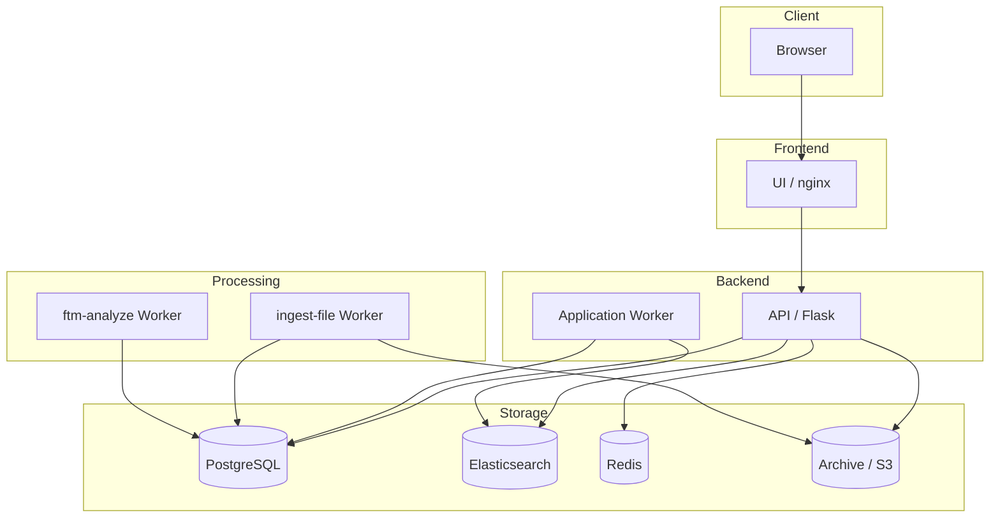
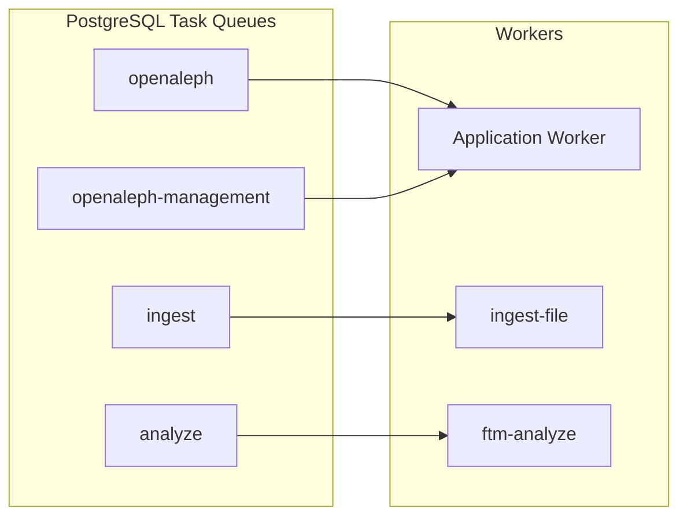
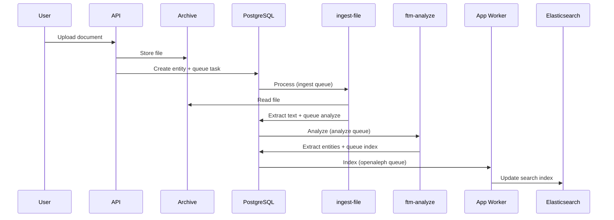
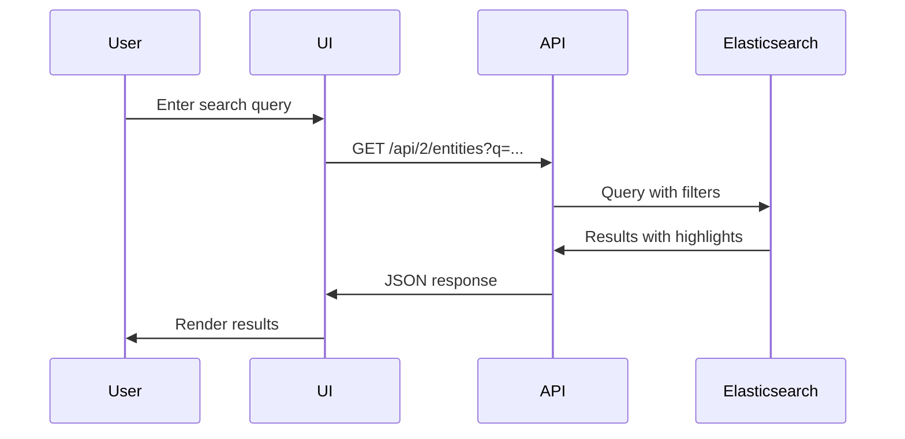

# Architecture Overview

This document describes the high-level architecture of Aleph for developers. For detailed service descriptions, see the [Services Overview](../102/services.md).

## External dependencies

Some parts of the logic are extracted into other libraries:

### Core logic

- [`openaleph-procrastinate`](https://openaleph.org/docs/lib/openaleph-procrastinate/) Task queue implementation
- [`openaleph-search`](https://openaleph.org/docs/lib/openaleph-search/) Elasticsearch mappings, indexer and query logic

### Processing services

- [`ingest-file`](https://openaleph.org/docs/lib/ingest-file/) Stage 1 of document processing (import, extract metadata & text, OCR)
- [`ftm-analyze`](https://openaleph.org/docs/lib/ftm-analyze/) Stage 2 of document processing (NER, language detection and other analysis)

## Components



## Data Stores

### PostgreSQL

PostgreSQL serves three distinct purposes (can be separate databases for large deployments):

| Purpose | Setting | Description |
|---------|---------|-------------|
| **Application data** | `OPENALEPH_DB_URI` | Users, groups, permissions, collection metadata |
| **Entities data** | `FTM_FRAGMENTS_URI` | FollowTheMoney entities (source of truth for search index) |
| **Task queue** | `PROCRASTINATE_DB_URI` | Job data for [Procrastinate](https://procrastinate.readthedocs.io/) workers |

### Elasticsearch

Full-text and keyword search index. Can be rebuilt from PostgreSQL entity data at any time.

- Setting: `OPENALEPH_ELASTICSEARCH_URI`
- Requires ICU Analysis plugin

### Redis

Application caching layer only. Not used for task queues.

- Setting: `REDIS_URL`
- Does not need to be persistent

### Archive

Source document storage (PDFs, images, etc.) addressed by SHA1 checksum.

- Setting: `ARCHIVE_TYPE` and `ARCHIVE_PATH` (or S3/GCS settings)
- Supports: local filesystem, S3, Google Cloud Storage

## Task Processing

Aleph uses [Procrastinate](https://procrastinate.readthedocs.io/) for background task processing. Tasks are stored in PostgreSQL and processed by workers.



| Queue | Worker | Purpose |
|-------|--------|---------|
| `openaleph` | Application Worker | Indexing, cross-referencing, entity updates |
| `openaleph-management` | Application Worker | Administrative tasks |
| `ingest` | ingest-file | Document processing, text extraction, OCR |
| `analyze` | ftm-analyze | Named entity recognition, language detection |

## Data Flow

### Document Ingestion



### Search



## Code Structure

### Backend (`aleph/`)

```
aleph/
├── views/          # API endpoints (Flask blueprints)
├── logic/          # Business logic
├── model/          # SQLAlchemy models
├── queues/         # Procrastinate task definitions
├── index/          # Elasticsearch indexing
└── migrate/        # Database migrations
```

### Frontend (`ui/src/`)

```
ui/src/
├── components/     # Reusable React components
├── screens/        # Page-level components
├── actions/        # Redux actions
├── reducers/       # Redux reducers
├── selectors/      # Redux selectors
└── app/            # App configuration, routing
```
